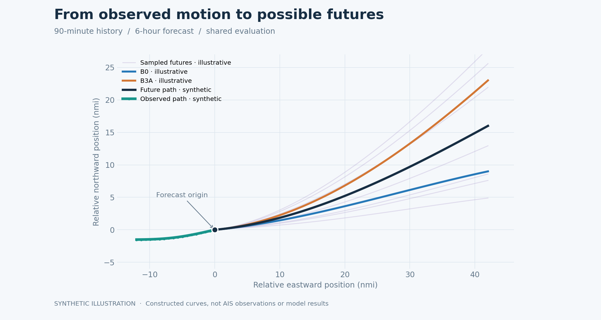

# Maritime trajectory forecasting

A shared PyTorch framework for TrAISformer, a direct Transformer (**B0**), and
B0 with strictly historical same-vessel context (**B3A**). Models share
[data loading](forecasting/data.py), [adapters](forecasting/adapters.py),
[training/evaluation](forecasting/runner.py), and [geographic metrics](evaluation/metrics.py).


*Constructed illustration; these curves are not trained-model results.*

## Quick start

Tested on Linux with **Python 3.10.20** and **PyTorch 2.11.0 (CPU)**.

```bash
python3.10 -m venv .venv
source .venv/bin/activate
python -m pip install -r requirements.txt
pytest -q
python scripts/train.py --config vessel_direct \
  --run-dir runs/smoke-b0 --device cpu --smoke
```

Tests need no dataset; training needs the files below. Use `traisformer` or
`vessel_direct_b3a` for the other models. See [the evaluation guide](docs/evaluation.md)
for full training, frozen test evaluation, comparison, and plotting commands.
GPU training requires a matching PyTorch/CUDA build.

## Data

[CT-DMA](https://github.com/CIA-Oceanix/TrAISformer/tree/main/data/ct_dma) is
processed [Danish AIS data](https://www.brs.dk/da/om-os/organisation/sikre-farvande/ais-data/).
Prepare `train.parquet`, `valid.parquet`, and `test.parquet` in `data/ct_dma/`;
upstream pickles need conversion. Each row contains aligned per-step arrays
`LAT/LON/SOG/COG/HEADING/ROT/TIMESTAMP/VESSEL_MMSI` and a scalar `TRAJECTORY_ID`.
The four input channels are normalized using [the dataset bounds](configs/dataset/ct_dma.yaml),
with a 300-second cadence. The loader also accepts the legacy parquet schema.

The separate Danish preprocessing filters and splits voyages, removes outliers,
and resamples to ten minutes; it does not create the CT-DMA benchmark splits.
It additionally needs `scipy`, `pyproj`, and `tqdm` (plus Folium for the notebook).
Data and checkpoints are excluded; processed-data redistribution terms remain
unverified. Unpublished findings are omitted from current documentation.

## Attribution and license

Stefan Schestakov authored the framework, B0/B3A, and experimental infrastructure.
The baseline adapts [Nguyen and Fablet's TrAISformer (2024)](https://doi.org/10.1109/ACCESS.2024.3349957)
and [upstream code](https://github.com/CIA-Oceanix/TrAISformer), correcting blur handling
and integrating the shared runner. Original code is **MIT**; the adapted baseline
retains **CeCILL-C**. minGPT and reused GeoTrackNet portions retain MIT notices.
All notices and complete license terms are in [LICENSE](LICENSE).
